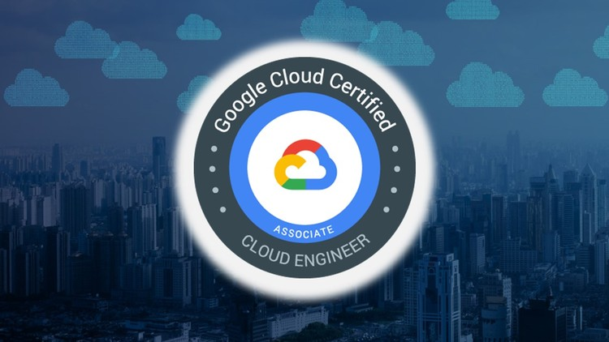

# Associate Cloud Engineer 

Resources preparing for Google Cloud Associate Cloud Engineer certification

* [Official Exam Overview ](https://cloud.google.com/certification/cloud-engineer) *offered by Google*
* [Let's talk with Dan Sullivan - author of the official Google Cloud Study Guides](https://www.youtube.com/watch?v=QOJGZqZdRS8) *offered on YouTube*
* [Preparing for Google Cloud Associate Cloud Engineer Exam](https://www.youtube.com/watch?v=RbIbS0YMFs4) *offered on YouTube*

## Online Training 

  * [Preparing for the Google Cloud Associate Cloud Engineer Exam](https://www.coursera.org/learn/preparing-cloud-associate-cloud-engineer-exam#syllabus) *offered on Coursera*
  * [Intro to Google Cloud | For Student Developers](https://www.youtube.com/watch?v=5RGyepqiEGw) *offered on YouTube*
  * [Introduction to Google Cloud Platform](https://acloud.guru/learn/gcp-101) *offered on A Cloud Guru*
  * [Google Cloud](https://www.coursera.org/googlecloud) *offered on Coursera*
  * [Google Cloud](https://www.pluralsight.com/authors/google-cloud?aid=7010a000002LUv2AAG&promo=&utm_source=non_branded&utm_medium=digital_paid_search_google&utm_campaign=XYZ_EMEA_Dynamic&utm_content=&gclid=EAIaIQobChMIqZz5kuj26QIVDflRCh0ijQeuEAAYASAAEgJB2_D_BwE) *offered on Pluralsight*
  * [Google Associate Cloud Engineer: Get Certified 2020](https://www.udemy.com/course/google-certified-associate-cloud-engineer-2019-prep-course/learn/lecture/16602228#overview) *offered on Udemy by Dan Sullivan*
  
  
## Books / Documentation

  * [Get started with Google Cloud](https://cloud.google.com/docs) *Google Cloud Documentation*
  * [Official Google Cloud Certified Associate Cloud Engineer Study Guide](https://www.amazon.co.uk/gp/product/1119564417/ref=ppx_yo_dt_b_search_asin_title?ie=UTF8&psc=1) *Book by Dan Sullivan*
  * [Google Cloud Platform in Action](https://www.amazon.com/Google-Cloud-Platform-Action-Geewax/dp/1617293520) *Book by JJ Geewax*
  
  
  ## Video / Sessions
  
  * [Google Cloud Platform](https://www.youtube.com/user/googlecloudplatform) *offered on YouTube*
  * [Cloudonair](https://cloudonair.withgoogle.com/) *Training from Googlers*
  * [The Cloud Girl](https://www.youtube.com/c/priyankavergadia/videos) *offered on YouTube*
  * [Linux Academy](https://www.youtube.com/user/pineheadtv/search?query=cloud) *offered on YouTube*
  * [Learn GCP with Mahesh](https://www.youtube.com/channel/UCL8vwy2jhEtQrC-Rx6qzCZg/videos) *offered on YouTube*
  * [Cloud Advocate](https://www.youtube.com/channel/UCjfE5EmNU1kyf1wwrtYlnGQ) *offered on YouTube*
  * [AwesomeGCP](https://www.youtube.com/channel/UCIGDDqu5DzlaaC4XzXj_4-A) *offered on YouTube*
  * [GCP for Dummies](https://www.youtube.com/channel/UCLqm0JFu9oqh_PccDg3mU0g) *offered on YouTube*
  
  
  ## Notes
  
  * [awesome-gcp-certifications](https://github.com/ddneves/awesome-gcp-certifications#Google-Cloud---Associate-Cloud-Engineer) *Repo by [ddneves](https://github.com/ddneves)*
  * [GCPSketchnote](https://github.com/priyankavergadia/GCPSketchnote?_lrsc=cabfae46-9c53-4921-86a2-0d2624c0cb78) *Repo by [
pvergadia](https://github.com/priyankavergadia)*
  * [gcp-learning](https://github.com/truar/gcp-learning) *Repo by [truar](https://github.com/truar)*
  * [GCP-CA-Notes](https://gist.github.com/dmunn/9874418f620b8aaf91d12507a91563ad) *Repo by [dmunn](https://gist.github.com/dmunn)*
  * [google-cloud-4-words](https://github.com/gregsramblings/google-cloud-4-words) *Repo by [gregsramblings](https://github.com/gregsramblings)*
  * [awesome-gcp-certifications](https://github.com/sathishvj/awesome-gcp-certifications/blob/master/associate-cloud-engineer.md) *Repo by [sathishvj](https://github.com/sathishvj)*
  * [GCP Certification Series, 1.1](https://medium.com/@prashantapaudel/gcp-certification-series-1-1-15cf8117f610) *by Prashanta Paudel*
  * [GCP Associate Cloud Engineer Deep Dive notes. Preparing for the exam](https://myblockchainexperts.org/2019/09/27/gcp-associate-cloud-engineer-deep-dive-notes-preparing-for-the-exam/)
* [Link topics to the official Exam Study Guide](https://docs.google.com/document/d/1u6pXBiGMYj7ZLBN21x6jap11rG6gWk7n210hNnUzrkI/edit) *offered on Google Docs*
* [ACE Study Topics & Models](https://docs.google.com/document/d/1if7Bbzrui1r-RaPO8ikwvcyg7Cv9sIFFZuE_fZP-9xE/edit#heading=h.n2bowj9d4vqj) *offered on Google Docs*

## GCP Cheatsheet

* [GCP cheatsheet](https://cloud.google.com/blog/products/management-tools/new-gcloud-cheat-sheet-available) *offered by Google*
* [GCP cheatsheet
](https://cheatsheet.dennyzhang.com/cheatsheet-gcp-a4) *by [dennyzhang](https://github.com/dennyzhang)*
* [GCP cheatsheet
](https://gist.github.com/pydevops/cffbd3c694d599c6ca18342d3625af97#012-app-engine) *by [pydevops](https://gist.github.com/pydevops)*
* [GCP command-line cheatsheet](https://itnext.io/gcp-command-line-cheatsheet-5e4434ca2c84#d8b9) *by [Daniel Weibel](https://itnext.io/@weibeld)*
* [gcloud sdk](https://cloud.google.com/sdk/gcloud/reference) *official docs*

 ## Qwiklabs / Hands on Training 
 
 
 * [A list of qwiklabs found on Pluralsight's Google Path](https://github.com/kibablu/PluralsightQwikLabs)
 * [Complete skill badges relevant to your certification](https://go.qwiklabs.com/certification)
 * [Introduction to Qwiklabs and Google Cloud Platform](https://www.youtube.com/watch?v=SXNcIDviJsM) *offered on Youtube*
* [Google Cloud Essentials](https://www.qwiklabs.com/quests/23?catalog_rank=%7B%22rank%22%3A1%2C%22num_filters%22%3A0%2C%22has_search%22%3Atrue%7D&search_id=5873288)
 * [Baseline: Infrastructure
](https://www.qwiklabs.com/quests/33?catalog_rank=%7B%22rank%22%3A1%2C%22num_filters%22%3A0%2C%22has_search%22%3Atrue%7D&search_id=5873251)
* [Networking in the Google Cloud](https://www.qwiklabs.com/quests/31?catalog_rank=%7B%22rank%22%3A1%2C%22num_filters%22%3A0%2C%22has_search%22%3Atrue%7D&search_id=6078607)
* [Cloud Engineering
](https://www.qwiklabs.com/quests/66?catalog_rank=%7B%22rank%22%3A1%2C%22num_filters%22%3A0%2C%22has_search%22%3Atrue%7D&search_id=5873277)
* [Kubernetes in Google Cloud
](https://www.qwiklabs.com/quests/29?catalog_rank=%7B%22rank%22%3A1%2C%22num_filters%22%3A0%2C%22has_search%22%3Atrue%7D&search_id=5873318)
* [Security & Identity Fundamentals](https://www.qwiklabs.com/quests/40)
* [Hello Cloud Run](https://www.qwiklabs.com/focuses/5162?catalog_rank=%7B%22rank%22%3A1%2C%22num_filters%22%3A0%2C%22has_search%22%3Atrue%7D&parent=catalog&search_id=6078620)

##  Practice Exam / Test

### THESE ARE NOT DUMPS!!! THEY ARE PRACTICE QUESTION. 

### Successful completion of the practice exam does not guarantee you will pass the certification exam as the actual exam is longer and covers a wider range of topics.

* [Associate Cloud Engineer Practice Exam](https://docs.google.com/forms/d/e/1FAIpQLSfexWKtXT2OSFJ-obA4iT3GmzgiOCGvjrT9OfxilWC1yPtmfQ/viewform)
* [Google Certified Associate Cloud Engineer Practice Exam](https://www.udemy.com/course/google-certified-associate-cloud-engineer-practice-exam-d/) *offered on Udemy*
* [Google Cloud Certified Associate Cloud Engineer](https://quizlet.com/328524759/google-cloud-certified-associate-cloud-engineer-flash-cards/) *offered on Quizlet*
* [GCP Cloud Associate Exam](https://quizlet.com/363585408/gcp-cloud-associate-exam-flash-cards/) *offered on Quizlet*
* [Google Associate Cloud Engineer Exam](https://www.examtopics.com/exams/google/associate-cloud-engineer/)
* [Google Cloud Associate Cloud Engineer Q/A](https://www.youtube.com/playlist?list=PLQMsfKRZZviRwqJwNmh1eAWnRMvlrk40x) *offered on YouTube*

## Success stories

* [Passing GCP: Associate Cloud Engineer](https://medium.com/@serourb/passing-gcp-associate-cloud-engineer-9bf45ebef26b) *by Serourb*
* [Writing and Passing the Google Cloud Associate Engineer Certification](https://medium.com/@sathishvj/writing-and-passing-the-google-cloud-associate-engineer-certification-a60c2f6d99c2) *by sathish vj*
* [So I passed Google’s Associate Cloud Engineer Certification](https://medium.com/@IvanYudhi/so-i-passed-googles-associate-cloud-engineer-certification-813bdf30d273) *by Ivan Yudhi*
* [How I Cleared 3 Google Cloud Certifications in 3 Weeks](https://medium.com/@yesdeepakverma/how-i-cleared-all-3-google-cloud-certifications-in-3-weeks-f5591aa22572) *by deepak verma*
* [How I was able to clear my Google Cloud Engineer exam](https://medium.com/@narayansharma91/how-i-was-able-to-clear-my-google-cloud-engineer-exam-c8553835fbb0) *by Narayan Sharma*
* [How did I Pass Google Cloud Certified Associate Cloud Engineer Exam?](https://www.whizlabs.com/blog/google-cloud-certified-associate-cloud-engineer-exam-review/)
* [From ALC to Google Certified Associate Cloud Engineer (ACE)](https://medium.com/@MercyMarkus/from-alc-to-google-certified-associate-cloud-engineer-b7e5707f9bf0) *by Mercy Markus*
* [Yes, you can pass the Google Cloud Associate Engineer exam](https://dev.to/gelopfalcon/yes-you-can-pass-the-google-cloud-associate-engineer-exam-e20) *by Falcon*

## Beginner Concepts 

### What is Cloud Computing?

* [Intro to Cloud Computing](https://www.udacity.com/course/intro-to-cloud-computing--ud080) *offered on Udacity*
* [Cloud Computing - CS50's Computer Science for Business Professionals 2017](https://www.youtube.com/watch?v=ngK97cSXWoM) *offered on YouTube*
* [Introduction to Cloud Computing](https://www.youtube.com/watch?v=QYzJl0Zrc4M) *offered on YouTube*
* [Cloud Fundamentals](https://www.youtube.com/playlist?list=PLOspHqNVtKAC-_ZAGresP-i0okHe5FjcJ) *offered on YouTube*
* [Cloud computing: A complete guide](https://www.ibm.com/cloud/learn/cloud-computing) *IBM Cloud*
* [A beginner’s guide to the basics of what cloud computing is about](https://medium.com/scientya/a-beginners-guide-to-the-basics-of-what-cloud-computing-is-about-e8b3b7f25a30)   *by Yahya Mohamed Mao*
* [An Introduction of Cloud Computing for Beginners](https://geekflare.com/cloud-computing-basics/)
* [Public Cloud vs Private Cloud vs Hybrid Cloud](https://www.youtube.com/watch?v=3WIJ4axzFlU) *offered on YouTube*
* [Pizza as a Service 2.0](https://medium.com/@pkerrison/pizza-as-a-service-2-0-5085cd4c365e) *by Paul Kerrison*

### Terminologies 
* [What is a Server? Servers vs Desktops Explained](https://www.youtube.com/watch?v=UjCDWCeHCzY) *offered on YouTube*
* [Virtualization and Hypervisors](https://medium.com/@devanshagarwal121/virtualization-and-hypervisors-9c4c8f4ab27d) *by Devansh Agarwal*
* [Virtualization Explained](https://www.youtube.com/watch?v=FZR0rG3HKIk) *offered on YouTube*
* [What is a Virtual Private Cloud?](https://www.youtube.com/watch?v=NbkPRn1mqlU) *offered on YouTube*
* [Containerization Explained](https://www.youtube.com/watch?v=0qotVMX-J5s) *offered on YouTube*
* [Virtual Machines vs Docker Containers - Dive Into Docker](https://www.youtube.com/watch?v=TvnZTi_gaNc) *offered on YouTube*
* [Introduction To Docker and Docker Containers](https://www.youtube.com/watch?v=JSLpG_spOBM) *offered on YouTube*
* [Hello Whale: Containers != Virtual Machines](https://codefresh.io/docker-tutorial/hello-whale-containers-virtual-machines/)
* [What is Docker?](https://opensource.com/resources/what-docker)
* [Kubernetes 101: Pods, Nodes, Containers, and Clusters](https://medium.com/google-cloud/kubernetes-101-pods-nodes-containers-and-clusters-c1509e409e16)
